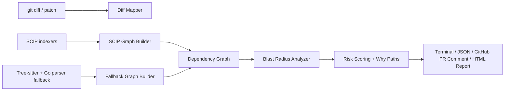

# TraceScope

A SCIP-backed PR blast-radius analyzer for Go code review.

TraceScope turns a diff into a ranked impact report:
`changed function -> dependency path -> affected code -> risk -> suggested reviewer`.

## Problem & Approach

**Problem:** code review usually shows what changed, but not what may break downstream.

**What this project does:** builds a repository dependency graph, maps a PR diff to changed
functions, traverses downstream dependencies, ranks impact risk, and generates reviewer-focused
GitHub PR comments.

**What is technically interesting:** SCIP ingestion, parser fallback, cross-file graph
construction, blast-radius traversal, call-path explanations, confidence-aware resolution
diagnostics, and CI-friendly output.

## Demo Output

```markdown
## TraceScope Blast Radius

**Risk:** HIGH
**Changed functions:** 2
**Affected functions:** 8
**Graph source:** scip

### Reviewer focus

1. `Build` - `internal/graph/builder.go:27`
   - Why path: `Build -> registerReferenceEdges -> addEdge`
   - Confidence: exact
   - Owners: `@graph-team`
   - Inspect: call resolution and import-edge behavior

2. `ComputeBlastRadius` - `internal/graph/pathfinder.go:18`
   - Why path: `Build -> ComputeBlastRadius`
   - Confidence: exact
   - Owners: `@platform-team`
   - Inspect: traversal depth, duplicate edge handling, and ranking changes
```

## Architecture



## Features

- **SCIP-first indexing** for Go via `scip-go`, with a tree-sitter parser fallback
- **Dependency graph model** of files, functions, classes, imports, calls, and inheritance
- **Blast-radius analysis** from changed functions to downstream impacted functions
- **Risk ranking** based on call depth, caller fan-in, exports, and propagation
- **Why-path explanations** for how a changed symbol reaches an affected symbol
- **Confidence diagnostics** for exact, heuristic, ambiguous, and unresolved edges
- **Ownership hints** from git blame and CODEOWNERS
- **CI/GitHub output** through terminal, JSON, exit codes, and PR comments
- **Optional HTML graph report** for visual exploration

## Language Support

TraceScope targets **Go**. The Go path is the tested, reliable one — `scip-go` provides
function-body ranges and accurate cross-file resolution, validated on real repositories.

TypeScript and Python indexing exist but are **experimental**: symbol coverage is
incomplete (many functions lack body ranges) and diff-to-function mapping is unreliable,
so blast-radius results on those languages should not be trusted yet.

## Installation

### Prerequisites

- Go 1.25+ (required by the `scip-code/scip` bindings; see `go.mod`)
- GCC for tree-sitter fallback parsing
- `scip-go` for high-quality Go symbol resolution:

```bash
go install github.com/scip-code/scip-go/cmd/scip-go@latest
```

The experimental TypeScript and Python indexers can also be installed
(`npm install -g @sourcegraph/scip-typescript @sourcegraph/scip-python`), but see
[Language Support](#language-support) first. `scip-python` fails on native Windows in
the published package, so TraceScope skips it there.

### Build

```bash
git clone https://github.com/Anuragp22/TraceScope.git
cd TraceScope
go build -o tracescope ./cmd/tracescope
```

## Core Commands

### Build the graph

```bash
tracescope index .
```

Behavior:
- Uses `index.scip` if one already exists at the repo root
- Otherwise tries `scip-go`, `scip-typescript index`, and `scip-python index`
- Merges generated SCIP indexes from `.tracescope/scip/`
- Falls back to built-in parsers if SCIP is unavailable
- Writes `.tracescope/graph.json`

Example:

```text
TraceScope - indexing /repo

  Found 89 files across 2 languages
  Using SCIP index: /repo/.tracescope/scip/scip-go.scip
  Using SCIP index: /repo/.tracescope/scip/scip-typescript-web.scip
  Built graph: 721 nodes, 2075 edges

  Stats:
    source:      scip
    CONTAINS:    696
    CALLS:       1308
    IMPORTS:     67
    IMPLEMENTS:  4
```

### Analyze blast radius

```bash
git diff origin/main...HEAD | tracescope analyze --owners
git diff origin/main...HEAD | tracescope analyze --github-comment --owners
tracescope analyze --diff changes.patch --depth 3 --top 10
```

### Explain a dependency path

```bash
tracescope why runAnalyze Score
tracescope why graph.Build analyzer.Score
tracescope why Score runAnalyze --reverse
```

### Find hotspots

```bash
tracescope hotspots --top 20
tracescope hotspots --lang go
```

### Validate SCIP vs parser fallback

```bash
tracescope validate-scip .
```

This compares a SCIP graph against the parser fallback graph and reports shared, missing,
and extra node/edge signatures.

## GitHub Actions

TraceScope dogfoods itself: every PR on this repository triggers a blast-radius
analysis and posts a comment with the impact report. See
[`.github/workflows/tracescope.yml`](.github/workflows/tracescope.yml) for the
workflow, or open any pull request to see it in action.

To add TraceScope to your own repository:

```yaml
- name: Index codebase
  run: tracescope index .

- name: Analyze blast radius
  run: git diff origin/main...HEAD | tracescope analyze --format json --top 20

- name: Post PR comment
  run: git diff origin/main...HEAD | tracescope analyze --github-comment --owners
```

Exit codes:

| Code | Meaning |
|------|---------|
| 0 | No risk or only low-risk impact |
| 1 | High-risk impacted functions |
| 2 | Medium-risk impacted functions |
| 3 | TraceScope error (bad input, missing graph, etc.) |

## Configuration

Create `.tracescope.yaml` in the repo root:

```yaml
ignore:
  - vendor/**
  - dist/**
  - node_modules/**

max_depth: 5
format: terminal
top: 20
graph_path: .tracescope/graph.json

risk:
  high_callers: 10
  high_exported_callers: 5
  medium_callers: 3
```

## Repository Layout

```text
cmd/tracescope/          CLI entry point
internal/cmd/            Cobra commands
internal/parser/         Parser fallback and file walking
internal/graph/          SCIP ingestion, parser graph builder, graph compare, BFS/path finding
internal/diff/           Unified diff parsing
internal/analyzer/       Diff-to-function mapping, blast-radius traversal, risk scoring, hotspots
internal/output/         Terminal, JSON, GitHub Markdown, HTML report
internal/ownership/      Git blame and CODEOWNERS
internal/server/         Local graph REST API (backs the optional dashboard)
web/                     Optional dashboard frontend
docs/                    Benchmarks and supporting notes
```

## Current Limitations

- TraceScope is a static-analysis prototype for PR impact analysis, not a full compiler or a
  replacement for an LLM reviewer like CodeRabbit
- Go is the supported, tested language; TypeScript and Python indexing are experimental and not yet reliable for real use
- SCIP and parser fallback graphs do not match 1:1 because SCIP carries richer semantic edges
- `scip-python` is skipped on native Windows because of an upstream package issue
- The dashboard is demo-only; the main product surface is the PR blast-radius comment

## Testing

```bash
go test ./... -race -count=1 -timeout 120s
```

Benchmark notes are in [docs/benchmark-real-repo.md](docs/benchmark-real-repo.md).
