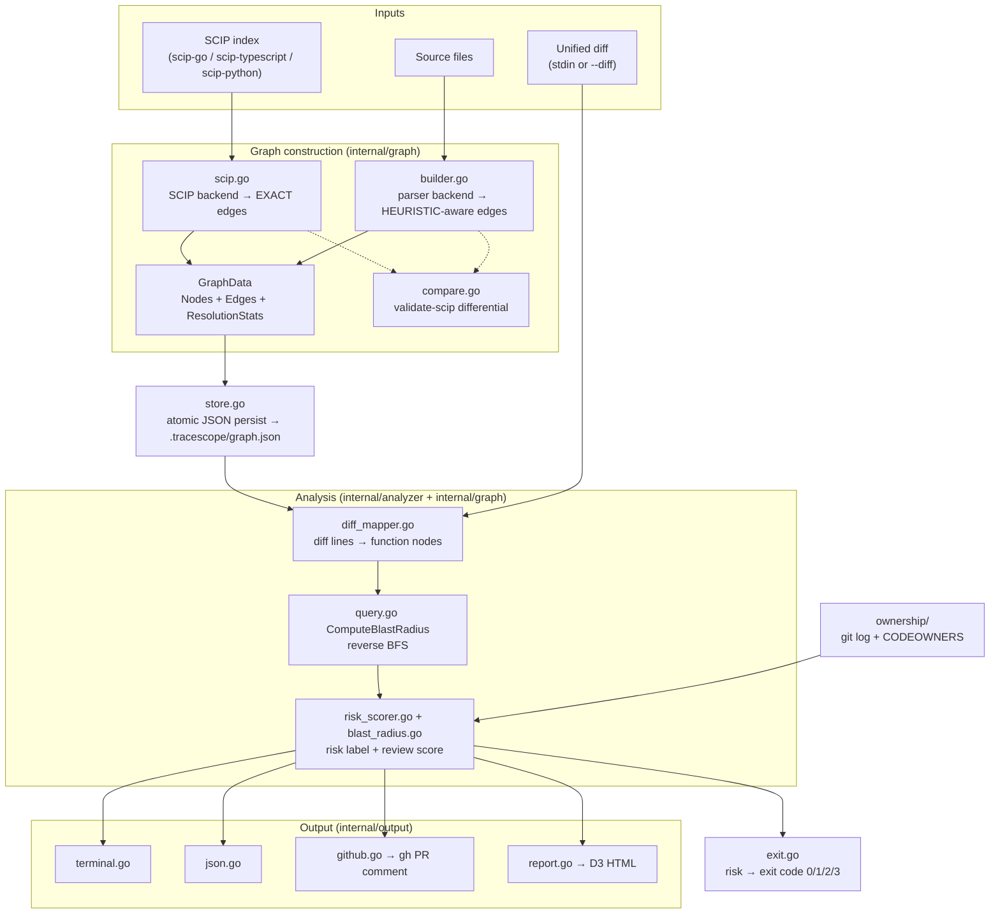
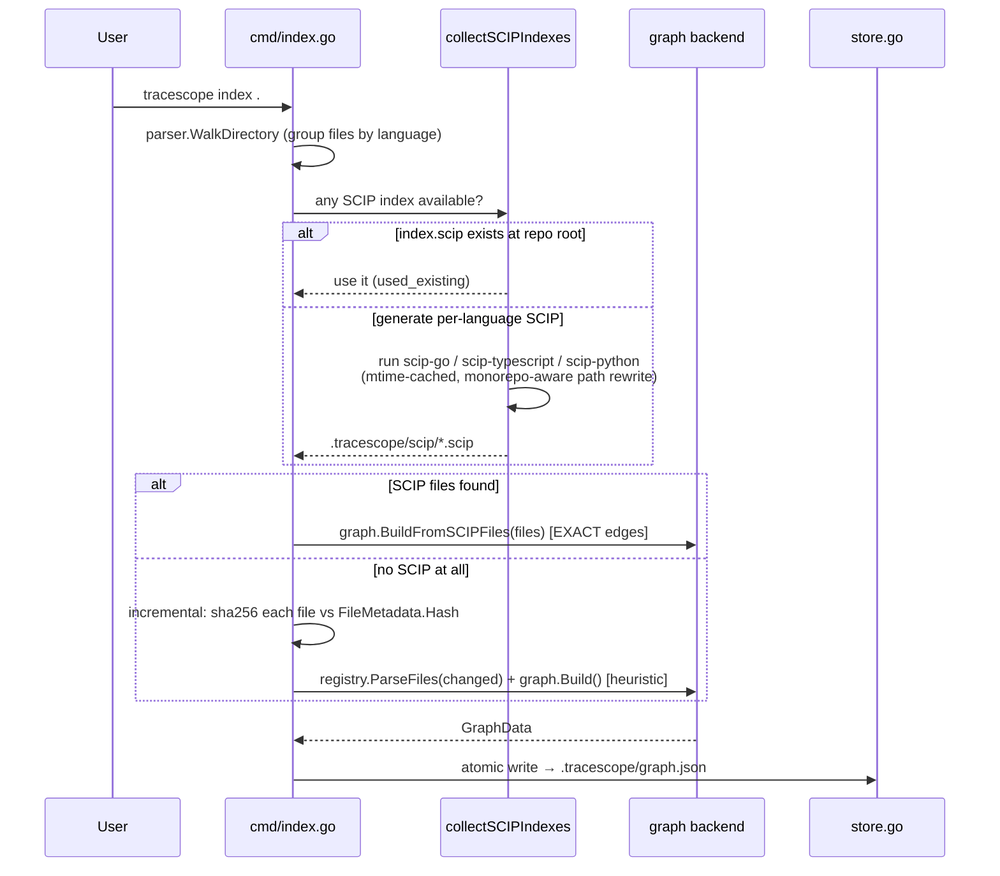

# TraceScope — Architecture

> Scope rule for this document: every claim is grounded in a file path you can open and verify.
> Where the *rationale* for a choice is not written in the code, it is marked **[ASSUMED]**.

---

## 1. What the system is

TraceScope is a **static-analysis CLI** (with an optional web dashboard) that answers one question for a pull request:

> *"If these functions changed, what else might break, how risky is it, and who should review it?"*

It does this by building a **dependency graph** of a repository (files → functions → classes, connected by `CONTAINS` / `CALLS` / `IMPORTS` / `EXTENDS` / `IMPLEMENTS` edges), mapping a diff onto the changed functions, then traversing the graph *backwards* (callers of the change) to compute a **blast radius**, scoring each impacted function for **risk**, and rendering the result to a terminal, JSON, a GitHub PR comment, or an interactive HTML report.

- Entry point: [cmd/tracescope/main.go](../cmd/tracescope/main.go) — a 16-line shell that delegates to `internal/cmd`.
- Module: `github.com/anurag/tracescope`, Go `1.25.0` per [go.mod](../go.mod:3) (README states "Go 1.22+", CI pins `1.22` — see [.github/workflows/tracescope.yml](../.github/workflows/tracescope.yml:21)).
- Size: ~8,125 non-test lines across `internal/`, 44 non-test Go files, 33 `_test.go` files.

---

## 2. The defining architectural idea: two graph backends, one model

The single most important structural decision is that TraceScope builds the **same `GraphData` model two different ways**, then has a command to *measure how close they are*:

1. **SCIP backend** ([internal/graph/scip.go](../internal/graph/scip.go)) — the precise path. Consumes a compiler-grade [SCIP](GLOSSARY.md) index produced by `scip-go` (and experimentally `scip-typescript` / `scip-python`). Every edge it emits is `EXACT`.
2. **Parser fallback backend** ([internal/graph/builder.go](../internal/graph/builder.go)) — the portable path. Builds the graph from TraceScope's own parsers (Go via `go/ast`+`go/types`; JS/TS/Python via tree-sitter) using name/path **heuristics** for cross-file resolution. Uncertain edges are tagged `HEURISTIC`.
3. **Differential harness** ([internal/graph/compare.go](../internal/graph/compare.go) + the `validate-scip` command in [internal/cmd/scip_validate.go](../internal/cmd/scip_validate.go)) — compares the two graphs by *content signatures* and reports shared / missing / extra nodes and edges.

Both backends produce the identical serializable type, `GraphData` ([internal/graph/types.go:98](../internal/graph/types.go:98)), so everything downstream (traversal, risk, output) is backend-agnostic.



---

## 3. Package layout and responsibilities

The codebase is a textbook **layered Go module** under `internal/` (so nothing is importable by outside projects). Dependencies flow strictly downward: `cmd` → `analyzer`/`output`/`ownership` → `graph`/`diff` → `parser`/`config`. No upward imports.

| Package | Responsibility | Key files |
|---|---|---|
| `cmd/tracescope` | `main()`; the only place `os.Exit` is called | [main.go](../cmd/tracescope/main.go) |
| `internal/cmd` | Cobra command tree, flag parsing, pipeline orchestration | [root.go](../internal/cmd/root.go), [index.go](../internal/cmd/index.go), [analyze.go](../internal/cmd/analyze.go), [why.go](../internal/cmd/why.go), [hotspots.go](../internal/cmd/hotspots.go), [report.go](../internal/cmd/report.go), [serve.go](../internal/cmd/serve.go), [scip_validate.go](../internal/cmd/scip_validate.go), [exit.go](../internal/cmd/exit.go), [helpers.go](../internal/cmd/helpers.go) |
| `internal/config` | `.tracescope.yaml` schema, defaults, upward file discovery | [config.go](../internal/config/config.go) |
| `internal/parser` | Per-language source parsing → uniform `FileResult`; file walking; parse cache | [golang.go](../internal/parser/golang.go), [typescript.go](../internal/parser/typescript.go), [javascript.go](../internal/parser/javascript.go), [python.go](../internal/parser/python.go), [treesitter.go](../internal/parser/treesitter.go), [walker.go](../internal/parser/walker.go), [registry.go](../internal/parser/registry.go), [cache.go](../internal/parser/cache.go) |
| `internal/graph` | The data model + both graph backends + persistence + traversal + comparison | [types.go](../internal/graph/types.go), [scip.go](../internal/graph/scip.go), [builder.go](../internal/graph/builder.go), [store.go](../internal/graph/store.go), [query.go](../internal/graph/query.go), [pathfinder.go](../internal/graph/pathfinder.go), [compare.go](../internal/graph/compare.go) |
| `internal/diff` | Unified-diff parsing → changed files + new-file line ranges | [parser.go](../internal/diff/parser.go) |
| `internal/analyzer` | Diff→function mapping, blast-radius orchestration, risk scoring, hotspots | [diff_mapper.go](../internal/analyzer/diff_mapper.go), [blast_radius.go](../internal/analyzer/blast_radius.go), [risk_scorer.go](../internal/analyzer/risk_scorer.go), [hotspots.go](../internal/analyzer/hotspots.go) |
| `internal/output` | Terminal/JSON/GitHub-Markdown/HTML renderers | [terminal.go](../internal/output/terminal.go), [json.go](../internal/output/json.go), [github.go](../internal/output/github.go), [report.go](../internal/output/report.go), [hotspots.go](../internal/output/hotspots.go), [path.go](../internal/output/path.go) |
| `internal/ownership` | Last-author lookup (`git log`) + CODEOWNERS reviewer suggestion | [ownership.go](../internal/ownership/ownership.go), [git_log.go](../internal/ownership/git_log.go), [codeowners.go](../internal/ownership/codeowners.go) |
| `internal/server` | Local HTTP REST API backing the dashboard | [server.go](../internal/server/server.go) |
| `web/` | Next.js 16 dashboard (read-mostly UI over the server) | [web/app](../web/app), [web/lib](../web/lib) |

**Why this structure** (grounded in what the code shows):
- **`internal/` everywhere** prevents the graph/analysis internals from becoming an accidental public API — the project is shipped as a CLI binary, not a library.
- **Model in the middle** (`internal/graph/types.go`) is the hub every other package depends on; it has no dependencies of its own, so it can be serialized and reused by parser-backend, SCIP-backend, analyzer, output, and server alike.
- **Orchestration lives only in `internal/cmd`**; the lower packages are pure transforms that return values and errors. This is what makes them unit-testable (33 test files) without spinning up a CLI.

---

## 4. The core data model

Defined in [internal/graph/types.go](../internal/graph/types.go). The graph is stored as **two flat slices**, not an adjacency structure — adjacency is rebuilt on demand per query (see §6). This keeps the graph trivially JSON-serializable.

```
GraphData
├── Nodes []Node            # id, type(file|function|class), name, file_path,
│                           # start/end line, package, language, is_export/test/init
├── Edges []Edge            # source, target, type(CONTAINS|CALLS|IMPORTS|EXTENDS|IMPLEMENTS),
│                           # confidence(EXACT|HEURISTIC)
├── IndexSource             # "scip" or "parser"
├── IndexerStatuses []      # which indexer ran / was skipped / failed, and why
├── FileMetadata map        # per-file hash + parsed-at, for incremental re-indexing
├── ResolutionStats         # counts: exact/heuristic/ambiguous/unresolved call & inheritance edges
└── ResolutionIssues []     # per-unresolved-reference diagnostics (capped at 200)
```

Three things here are unusual for an app of this size and worth noting:
- **Per-edge confidence** ([types.go:47](../internal/graph/types.go:47)) — every edge records how trustworthy it is.
- **Self-auditing graph** — `ResolutionStats` / `ResolutionIssues` ([types.go:54-77](../internal/graph/types.go:54)) record what *failed* to resolve, not just what succeeded. The graph reports its own precision.
- **Incremental-index metadata** — `FileMetadata.Hash` ([types.go:80](../internal/graph/types.go:80)) is the content hash used to skip re-parsing unchanged files.

---

## 5. Data flow — the two pipelines

### 5a. `index` — build the graph



Key decision points, all in [internal/cmd/index.go](../internal/cmd/index.go):
- **SCIP precedence**: a pre-existing root `index.scip` wins outright; else generate per-language SCIP under `.tracescope/scip/`; else fall back to parsers ([index.go:226-236](../internal/cmd/index.go:226)).
- **Incremental parser indexing**: only when a prior graph + non-empty parse cache exist; per file it recomputes `sha256` and reuses the cached `FileResult` if the hash matches ([index.go:110-136](../internal/cmd/index.go:110)).
- **Monorepo-aware SCIP**: JS/TS sources are grouped by nearest `package.json`, one SCIP run per package, then document paths are rewritten to be repo-relative ([index.go:335-475](../internal/cmd/index.go:335)).

### 5b. `analyze` — compute blast radius from a diff

```mermaid
sequenceDiagram
    participant CI as CI / shell
    participant AN as cmd/analyze.go
    participant DP as diff/parser.go
    participant MAP as analyzer/diff_mapper.go
    participant BR as graph/query.go
    participant RS as analyzer/risk_scorer.go
    participant OUT as output/*
    participant EX as cmd/exit.go

    CI->>AN: git diff ... | tracescope analyze --github-comment --owners
    AN->>DP: ParseUnifiedDiff(stdin)  → changed files + new-file line ranges
    AN->>MAP: map line ranges to function nodes (interval overlap)
    AN->>BR: ComputeBlastRadius(seeds, maxDepth)  → reverse BFS
    AN->>RS: Score each affected fn (prod callers, depth, export)
    AN->>OUT: render terminal / JSON / GitHub comment
    AN->>EX: return RiskExitError → exit 0/1/2; or 3 on failure
```

---

## 6. How traversal actually works (the algorithmic heart)

All in [internal/graph/query.go](../internal/graph/query.go).

`ComputeBlastRadius` is a **depth-limited reverse BFS** (default depth 5). "Reverse" because we start from the *changed* functions (seeds) and walk to everything that *depends on* them — `A calls B`, so if `B` changed, `A` is affected ([query.go:48-49](../internal/graph/query.go:48)).

Three details make it more than a textbook BFS:

1. **It follows `CALLS`, `CONTAINS`, `EXTENDS`, `IMPLEMENTS` in reverse — but deliberately *not* `IMPORTS`** ([query.go:20-22](../internal/graph/query.go:20)), because import edges would over-inflate the radius (every file importing a package would look "affected").

2. **The class-hub guard** ([query.go:48-57](../internal/graph/query.go:55)): a `CALLS` edge is only traversed in reverse if its target is a `NodeFunction`. SCIP emits `CALLS` edges from a function to *types* it references (e.g. a `*Context` parameter); without this guard, a popular type becomes a hub that floods the radius with every type user. This was a real bug fixed in commit `f84e4cd`.

3. **Confidence propagation** ([query.go:116](../internal/graph/query.go:116), `mergeConfidence` at [query.go:125](../internal/graph/query.go:125)): the confidence assigned to an affected node is the **weakest link** along its path from a seed. If any hop was `HEURISTIC`, the whole impact claim is `HEURISTIC`. So the result tells you not just *what* is affected but *how much to trust each claim*.

Performance choice: the BFS uses a **slice-backed queue with a head index** ([query.go:82-98](../internal/graph/query.go:82)) "to avoid per-element list allocations" — a deliberate contrast with [pathfinder.go](../internal/graph/pathfinder.go), which uses `container/list` for the simpler `why` query.

---

## 7. Risk scoring — two distinct scores

The analyzer produces **two separate numbers per affected function**, and they answer different questions ([internal/analyzer/blast_radius.go](../internal/analyzer/blast_radius.go), [risk_scorer.go](../internal/analyzer/risk_scorer.go)):

- **Risk label** (`HIGH`/`MEDIUM`/`LOW`) — for humans and CI gating. A first-match-wins threshold ladder keyed on **production caller count** (test callers excluded), export status, and depth ([risk_scorer.go:40-69](../internal/analyzer/risk_scorer.go:40)). Thresholds (10/5/3) are config-tunable.
- **Review score** (integer) — the *ranking* signal that sorts the report ([blast_radius.go:242-280](../internal/analyzer/blast_radius.go:242)). Base 80/50/20 by risk, plus **capped** caller bonuses (`min(prodCallers*4, 24)` + `min(callers*2, 12)`) so one mega-hub can't dominate, plus export/non-test bonuses, depth proximity bonuses, and a `-8` penalty for `HEURISTIC` confidence.

The final affected-function ordering is fully deterministic: review score → risk → caller count → depth → name → node ID as the unique tiebreaker ([blast_radius.go:182-201](../internal/analyzer/blast_radius.go:182)). Determinism is treated as a correctness property throughout (Go map iteration is randomized, so unstable output would break CI diffs).

---

## 8. Output and CI integration

- Four renderers in `internal/output`. Convention: **machine-readable JSON → stdout; everything human → stderr** ([json.go](../internal/output/json.go) vs the `Fprintln(os.Stderr, ...)` calls in [terminal.go](../internal/output/terminal.go)), so `tracescope ... | jq` works cleanly.
- The GitHub comment is an **idempotent upsert**: a hidden HTML marker `<!-- tracescope-blast-radius -->` ([github.go:15](../internal/output/github.go:15)) lets a re-run *update* the existing comment instead of spamming, all driven through the `gh` CLI.
- The HTML report embeds D3 v7 at compile time via `go:embed` ([report.go:14-18](../internal/output/report.go:14)) for a fully offline, self-contained interactive force-directed graph.
- **Exit codes are the CI contract** ([exit.go](../internal/cmd/exit.go)): `0` = no significant risk, `1` = HIGH, `2` = MEDIUM, `3` = tool failure. Crucially, a *broken invocation* (bad diff, missing graph) exits `3`, never `1`, so CI can't confuse "tool crashed" with "dangerous PR" ([exit.go:19-21](../internal/cmd/exit.go:19)). Risk results travel up as a typed `*analyzer.RiskExitError` and are mapped in exactly one place.
- TraceScope **dogfoods itself**: [.github/workflows/tracescope.yml](../.github/workflows/tracescope.yml) runs `tracescope analyze --github-comment` on every PR to this repo.

---

## 9. The web tier (secondary surface)

[internal/server/server.go](../internal/server/server.go) is a `gorilla/mux` REST API that serves a pre-computed graph and runs blast-radius/hotspot/why queries on demand. [web/](../web) is a Next.js 16 App Router dashboard (React 19, TanStack Query, better-auth GitHub OAuth, `react-force-graph-3d` for a 3D explorer). The README is explicit that the dashboard is **demo-only**; the primary product surface is the PR comment. Remaining seam documented in [TECH_DECISIONS.md](TECH_DECISIONS.md): several backend endpoints (`/api/why`, `/api/analyze/branches`, `/api/reload`) are implemented but have no dashboard UI yet.

---

## 10. Cross-cutting design themes

These recur in nearly every package and are the project's "fingerprint":

1. **Precision over recall.** When resolution is ambiguous, the code emits *no edge* rather than a wrong one ([builder.go](../internal/graph/builder.go) `resolveUnique`); ties in Go import resolution return `""`. The whole `HEURISTIC` confidence tier exists to be honest about guesses.
2. **Determinism as correctness.** Sorted node IDs, sorted symbol iteration with explicit "Go map iteration is randomized" comments ([scip.go:221-227](../internal/graph/scip.go:221)), alphabetical tiebreaks everywhere.
3. **Graceful degradation.** Partial Go ASTs are kept on syntax errors; a corrupt cache self-heals to empty; missing CODEOWNERS/`gh`/`node` are non-fatal; `git log` failures silently skip a file.
4. **Durability.** Both the graph store and the parse cache use **temp-file + atomic rename** ([store.go:20-47](../internal/graph/store.go:20), [cache.go](../internal/parser/cache.go)) so a crash mid-write can't corrupt existing state.
5. **Hybrid trust.** For Go, trust SCIP for symbol *identity* but re-run `go/ast` to get accurate function *body bounds* ([scip.go:257-287](../internal/graph/scip.go:257)) — see [INTERVIEW_PREP.md](INTERVIEW_PREP.md) §"Hardest problem".
